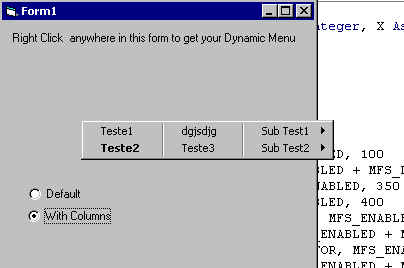



## Menu PopUP

### Description

Forget about the PopUPMenu function in vb that restrict you just to use existing menus to use like popupmenus, with this class you will create dynamic popup menus with submenus and columns if you want.. if you like and don't want to vote. just send a comment...

( The dll code is inside zip, u just need the dll to binary compatibility ) now the dll is inside..

Don't forget to vote now!!!
 
### More Info
 
the code is at http://www.planet-source-code.com/vb/scripts/ShowCode.asp?lngWId=1&txtCodeId=14735

             |
---                |---
**Submitted On**   |2001-01-26 09:59:46
**By**             |[Laudeci Oliveira](https://github.com/Planet-Source-Code/PSCIndex/blob/master/ByAuthor/laudeci-oliveira.md)
**Level**          |Advanced
**User Rating**    |4.7 (99 globes from 21 users)
**Compatibility**  |VB 4\.0 \(32\-bit\), VB 5\.0, VB 6\.0
**Category**       |[Custom Controls/ Forms/  Menus](https://github.com/Planet-Source-Code/PSCIndex/blob/master/ByCategory/custom-controls-forms-menus__1-4.md)
**World**          |[Visual Basic](https://github.com/Planet-Source-Code/PSCIndex/blob/master/ByWorld/visual-basic.md)
**Archive File**   |[CODE\_UPLOAD142681292001\.zip](https://github.com/Planet-Source-Code/laudeci-oliveira-menu-popup__1-14792/archive/master.zip)

